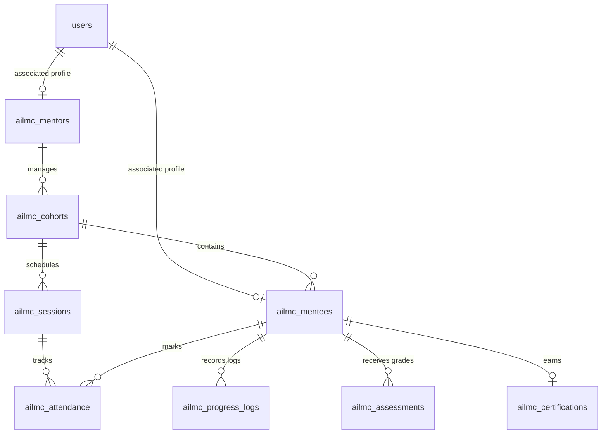

# AI Literacy Mission @ Campus (AILMC) Portal

An enterprise-grade, fullstack training and cohort-tracking portal designed to orchestrate the **AI Literacy Mission @ Campus**—a nationwide initiative by **Millionminds** targeting the training of **One Million GenZ students and young professionals across India** in the Fundamentals of AI and Generative AI productivity tools.

---

## 📖 Program Overview
The curriculum is designed as a rigorous **70-hour** structured learning program divided into three distinct, high-impact tracks:

1. **MasterClass (30 Hours)**: Expert-led online sessions covering fundamental and advanced Generative AI concepts, Large Language Models (LLMs), prompt engineering, and production deployment architectures.
2. **Self-Practice (30 Hours)**: Practical, hands-on labs where students write custom agents, interact with AI APIs, design local prompt templates, and build mini-projects on their local systems.
3. **Capstone Phase (10 Hours)**: A final application development phase where students build a production-grade AI solution addressing a real-world problem and present it to their peer cohort.

---

## 🛠️ Technology Stack

The AILMC application is built using a modern fullstack architecture split into a secure Spring Boot backend API and a fast, responsive React client.

### Backend (REST API)
* **Runtime**: [Java 21 JRE/JDK](https://adoptium.net/) (Java 21 toolchain)
* **Framework**: Spring Boot 4.1.0 (with Spring Web MVC)
* **Security & Auth**: Spring Security with Stateless JSON Web Token (JWT) validation using `jjwt` (version `0.13.0`)
* **Persistence**: Spring Data JPA & Hibernate
* **Database Migration**: Flyway MySQL migration management
* **Database**: MySQL (Aiven Cloud / Local instance support)
* **Other Libraries**: Lombok (code generation), Spring Boot Mail (notification emails), Spring Boot Validation (request input validation)

### Frontend (Single Page Application)
* **Runtime/Bundler**: Node.js & Vite
* **Library**: React 19 (React & React DOM)
* **Routing**: React Router v7 (declarative client-side routing)
* **Styling**: Tailwind CSS v3, PostCSS, Autoprefixer
* **HTTP Client**: Axios (configured with request interceptor for JWT authorization header attachment)
* **Linter**: Oxlint (ultra-fast JS/JSX linter)

---

## 🔑 Role-Based Features & Workflows

AILMC employs a Role-Based Access Control (RBAC) mechanism defining three distinct access layers:

### 1. 🎓 Mentee (Student) Dashboard
Mentees enroll in the program, track their hours, and claim their certifications.
* **Cohort Enrolment**: Browse open, mentor-led cohorts filtered by city, and join a preferred cohort (restricted to one cohort at a time).
* **Learning Tracker**: A live tracker where mentees log their progress per track (`MASTER_CLASS`, `SELF_PRACTICE`, `CAPSTONE`), documenting hours spent, topics covered, learning outcomes, and productivity impact.
* **Attendance Log**: View cumulative attendance metrics, marked present/absent logs, and the overall attendance percentage.
* **Grades & Feedback**: Access scores and feedback shared by the cohort mentor for Quizzes, Final Exams, and Capstone evaluations.
* **Certificate Claim**: Claim a public certification upon satisfying completion criteria (completion of Capstone, mentor rating, and validation of the processing fee).

### 2. 👨‍🏫 Mentor Dashboard
Mentors are qualified guides (usually senior college mentors or industry practitioners) managing cohorts and tracking mentee development.
* **Cohort Administration**: Create and configure local training cohorts (e.g., location, capacity, timing).
* **Session Scheduling**: Schedule session timings, define lesson topics, and specify the mode (Online or Offline).
* **Attendance Tracking**: Register student attendance for scheduled sessions in bulk or individually.
* **Academic Grading**: Grade student assignments (Quiz 1, Quiz 2, Final Test, Capstone) and submit detailed qualitative feedback.
* **Certificate Issuance**: Evaluate Capstone completions, assign mentor ratings, and officially issue completion certificates to successful mentees.

### 3. 🛡️ Super Admin Panel
Administrators manage system configurations, monitor program metrics, and handle operations.
* **Enterprise Analytics**: Monitor program-wide statistics including total enrolled mentors/mentees, active cohorts, issued certificates, and revenue status.
* **User Management**: Approve and verify mentor credentials and onboard registered mentees.
* **Cohort Scheduling**: Audit and manage cohorts configured by mentors.
* **Finance Validation**: Verify processing fee payments to toggle certificate release states from `PENDING` to `PAID`.

---

## 🗄️ Database Architecture

The data structure is managed through MySQL and versioned using Flyway migrations. The initial schema is located in [V1__initial.sql](file:///d:/Spring/AILMC/src/main/resources/db/migration/V1__initial.sql).



### Table Definitions:
1. **`users`**: Central credentials table storing email, BCrypt-encrypted password, and role (`SUPER_ADMIN`, `MENTOR`, `MENTEE`).
2. **`ailmc_mentees`**: Stores mentee-specific metadata including occupation, city, target skill, AI goals, and their enrolled `cohort_id`.
3. **`ailmc_mentors`**: Stores mentor details like college affiliation, technical stack expertise, preferred domains, and LinkedIn profiles.
4. **`ailmc_cohorts`**: Represents student groups. Stores cohort name, city, schedule options, maximum size, cohort status, and the owner `mentor_id`.
5. **`ailmc_sessions`**: Defines individual training sessions scheduled for a cohort, including day number, topic, timing, and mode (`ONLINE`/`OFFLINE`).
6. **`ailmc_attendance`**: Tracks attendance details linking `session_id`, `mentee_id`, presence bit, and completion timestamp.
7. **`ailmc_progress_logs`**: Holds student self-reported learning logs (track type, hours completed, topics covered, qualitative outcomes, and productivity impact notes).
8. **`ailmc_assessments`**: Stores grades for evaluations (`QUIZ_1`, `QUIZ_2`, `FINAL_TEST`, `CAPSTONE`), linking scores and mentor feedback to a mentee.
9. **`ailmc_certifications`**: Manages certification issuance, mentor ratings, processing fee details, payment status, and issuance time.

---

## 🔌 API Endpoints Reference

All security constraints are configured in [SecurityConfig.java](file:///d:/Spring/AILMC/src/main/java/com/example/ailmc/config/SecurityConfig.java).

| Endpoint | HTTP Method | Allowed Role(s) | Description |
| :--- | :---: | :---: | :--- |
| `/api/auth/register` | `POST` | Public | Register a new User and create a corresponding Mentor/Mentee profile |
| `/api/auth/login` | `POST` | Public | Authenticate a user and return a JWT Token |
| `/api/mentee/profile` | `GET` | `MENTEE` | Get profile metadata, cohort status, and completed learning hours |
| `/api/mentee/cohorts` | `GET` | `MENTEE` | Browse available (open) cohorts, optionally filtered by city |
| `/api/mentee/cohorts/{cohortId}/join` | `POST` | `MENTEE` | Enroll in an open cohort (one active enrollment limit) |
| `/api/mentee/tracker` | `GET` | `MENTEE` | Retrieve complete learning journey, logged hours per track, and logs |
| `/api/mentee/tracker` | `POST` | `MENTEE` | Submit a new learning progress log |
| `/api/mentee/attendance` | `GET` | `MENTEE` | View individual attendance summary and attendance percentage |
| `/api/mentee/assessments` | `GET` | `MENTEE` | View graded assessments, scores, and feedback |
| `/api/mentor/profile` | `GET` | `MENTOR` | Fetch logged-in mentor profile and all managed cohorts |
| `/api/mentor/cohorts` | `GET` | `MENTOR` | Fetch all cohorts created by the mentor |
| `/api/mentor/cohorts` | `POST` | `MENTOR` | Create a new cohort under the logged-in mentor |
| `/api/mentor/cohorts/{cohortId}/members` | `GET` | `MENTOR` | Get a list of mentees enrolled in a specific cohort |
| `/api/mentor/cohorts/{cohortId}/progress` | `GET` | `MENTOR` | Review total hours logged by mentees in a cohort |
| `/api/mentor/cohorts/{cohortId}/sessions` | `POST` | `MENTOR` | Schedule a training session for a cohort |
| `/api/mentor/cohorts/{cohortId}/sessions` | `GET` | `MENTOR` | Get all scheduled sessions for a cohort ordered by day |
| `/api/mentor/sessions/{sessionId}/attendance`| `POST` | `MENTOR` | Mark attendance for a single mentee |
| `/api/mentor/sessions/{sessionId}/attendance/bulk`| `POST` | `MENTOR` | Mark attendance for all mentees in a cohort simultaneously |
| `/api/mentor/sessions/{sessionId}/attendance`| `GET` | `MENTOR` | View attendance list for a specific session |
| `/api/mentor/assessments` | `POST` | `MENTOR` | Grade a mentee's assessment (Quiz 1/2, Final Test, Capstone) |
| `/api/mentor/cohorts/{cohortId}/assessments` | `GET` | `MENTOR` | Fetch assessments of a particular type for all cohort members |
| `/api/cert/issue/{menteeId}` | `POST` | `MENTOR` | Officially issue a certificate to a mentee (triggers success email) |
| `/api/cert/my` | `GET` | `MENTEE` | View issued certificate and payment details |
| `/api/admin/stats` | `GET` | `SUPER_ADMIN` | Fetch dashboard analytics metrics |
| `/api/admin/mentors` | `GET` | `SUPER_ADMIN` | Fetch profiles of all registered mentors and their cohorts |
| `/api/admin/cohorts` | `GET` | `SUPER_ADMIN` | Fetch all scheduled cohorts in the database |
| `/api/admin/mentees` | `GET` | `SUPER_ADMIN` | Fetch profiles of all enrolled mentees and cohort assignments |
| `/api/admin/certifications` | `GET` | `SUPER_ADMIN` | View all issued certificates and payment details |
| `/api/cert/{certId}/payment` | `PATCH` | `SUPER_ADMIN` | Update certificate payment status from `PENDING` to `PAID` |

---

## 🚀 Getting Started (Local Run)

Follow these instructions to run the application on your local machine.

### Prerequisites
* **Java**: [Java JDK 21](https://adoptium.net/temurin/releases/?version=21)
* **Node.js**: [Node.js LTS (v18+ or v20+)](https://nodejs.org/)
* **Database**: Local installation of MySQL (v8.0+) or an active cloud database connection

---

### Step 1: Database Setup
1. Create a MySQL database named `ailmc_db_local` (or configure your preferred name):
   ```sql
   CREATE DATABASE ailmc_db_local;
   ```
2. Place a configuration file in the project root named `.env` containing your target connection strings. An example of the `.env` template is provided below:
   ```env
   DB_URL=jdbc:mysql://localhost:3306/ailmc_db_local?useSSL=false&allowPublicKeyRetrieval=true
   DB_USER=root
   DB_PASSWORD=your_mysql_password
   JWT_SECRET=404E635266556A586E3272357538782F413F4428472B4B6250645367566B5970
   MAIL_USERNAME=your_gmail_address@gmail.com
   MAIL_PASSWORD=your_google_app_password
   APP_BASE_URL=http://localhost:8080
   ```

---

### Step 2: Running the Spring Boot Backend
The backend utilizes Gradle wrapper configurations.
1. Navigate to the project root:
   ```powershell
   cd d:\Spring\AILMC
   ```
2. Build and run the backend server:
   ```powershell
   ./gradlew bootRun
   ```
3. The server starts on port `8080` by default.
4. **Flyway Migrations**: Flyway will automatically execute database migrations on startup using script [V1__initial.sql](file:///d:/Spring/AILMC/src/main/resources/db/migration/V1__initial.sql) to set up tables.
5. **Initial Admin Creation**: On startup, [DataInitializer.java](file:///d:/Spring/AILMC/src/main/java/com/example/ailmc/config/DataInitializer.java) verifies if a default administrator account exists. If not, it provisions the following credentials:
   * **Username**: `admin@ailmc.com`
   * **Password**: `Admin@123`
   * **Role**: `SUPER_ADMIN`

---

### Step 3: Running the React Frontend
The frontend React app is bundled using Vite.
1. Navigate to the `frontend` folder:
   ```powershell
   cd d:\Spring\AILMC\frontend
   ```
2. Install dependencies:
   ```powershell
   npm install
   ```
3. Start the Vite development server:
   ```powershell
   npm run dev
   ```
4. By default, the application will run locally at [http://localhost:5173](http://localhost:5173).
5. The API connection is established through an Axios instance mapped in [axios.js](file:///d:/Spring/AILMC/frontend/src/api/axios.js).

---

## 🐳 Docker Production Deployment

To package the application as a single production-ready Docker container, a multi-stage [Dockerfile](file:///d:/Spring/AILMC/Dockerfile) is provided in the project root.

1. **Stage 1 (Builder)**: Leverages `eclipse-temurin:21-jdk` to execute a Gradle wrapper build, yielding a deployable executable Jar.
2. **Stage 2 (Runtime)**: Utilizes a lightweight `eclipse-temurin:21-jre` base image to execute the packaged Jar on container startup.

To build and run:
```powershell
# Build Docker image
docker build -t ailmc-app:latest .

# Run Docker container mapping port 8080
docker run -d -p 8080:8080 \
  -e DB_URL="jdbc:mysql://<your-db-host>:3306/<db-name>" \
  -e DB_USER="your-db-user" \
  -e DB_PASSWORD="your-db-password" \
  -e JWT_SECRET="your-jwt-secret-key" \
  -e MAIL_USERNAME="your-smtp-username" \
  -e MAIL_PASSWORD="your-smtp-app-password" \
  -e APP_BASE_URL="http://localhost:8080" \
  --name ailmc-container ailmc-app:latest
```

---

## 📂 Source Code Structure

Below is an overview of the core project structure and code assets:

* `.` (Project Root)
  * [build.gradle](file:///d:/Spring/AILMC/build.gradle) — Gradle dependencies and JVM configs.
  * [Dockerfile](file:///d:/Spring/AILMC/Dockerfile) — Deployment script.
  * [src/main/java/com/example/ailmc/](file:///d:/Spring/AILMC/src/main/java/com/example/ailmc/)
    * [AilmcApplication.java](file:///d:/Spring/AILMC/src/main/java/com/example/ailmc/AilmcApplication.java) — Backend entry point.
    * `config/`
      * [SecurityConfig.java](file:///d:/Spring/AILMC/src/main/java/com/example/ailmc/config/SecurityConfig.java) — Configures CORS/RBAC constraints.
      * [DataInitializer.java](file:///d:/Spring/AILMC/src/main/java/com/example/ailmc/config/DataInitializer.java) — Database seed bootstrap.
    * `controllers/` — Exposed REST Endpoints (e.g., [AuthController.java](file:///d:/Spring/AILMC/src/main/java/com/example/ailmc/controllers/AuthController.java), [AdminController.java](file:///d:/Spring/AILMC/src/main/java/com/example/ailmc/controllers/AdminController.java)).
  * [frontend/](file:///d:/Spring/AILMC/frontend/)
    * [package.json](file:///d:/Spring/AILMC/frontend/package.json) — Frontend dependencies.
    * `src/`
      * [App.jsx](file:///d:/Spring/AILMC/frontend/src/App.jsx) — Declarative router mapping.
      * `api/`
        * [axios.js](file:///d:/Spring/AILMC/frontend/src/api/axios.js) — Base Axios client.
      * `context/`
        * [AuthContext.jsx](file:///d:/Spring/AILMC/frontend/src/context/AuthContext.jsx) — Handles user authentication context.
